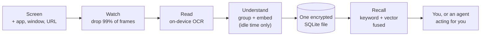

<h1 align="center">Hippocampus</h1>

<p align="center"><strong>Your computer already sees everything you do. It just doesn't remember any of it.</strong></p>

<p align="center">
  <a href="#try-it-in-about-a-minute">Try it</a> ·
  <a href="#see-it-work">See it work</a> ·
  <a href="#how-it-works">How it works</a> ·
  <a href="#what-works-and-what-doesnt">Honest status</a> ·
  <a href="#how-this-compares">Compared to mem0 and supermemory</a>
</p>

---

Hippocampus is a Mac app that remembers what was on your screen, so you can ask for it later in plain language.

Not "what file was that in." **"That pricing page I looked at last Tuesday, when I was annoyed."** You remember situations. Your computer remembers filenames. This closes that gap.

It runs entirely on your machine. There is no server to trust, because there is no server.

- **Local by construction, not by policy.** Screen text is parsed on-device, embedded on the Neural Engine, and written to one encrypted SQLite file. No API key is needed and nothing is sent anywhere.
- **One file, one lock.** Everything (rows, full-text index, vectors) lives inside a single SQLCipher database. Deleting a memory crypto-shreds it.
- **Search the way you remember.** Keyword search for exact things like an error code, vector search for vague things like "that pricing discussion," fused into one ranked list. (The engine does both; the CLI below exposes the keyword half. See [what works](#what-works-and-what-doesnt).)
- **Blocked at the source.** Password prompts, private browsing, and DRM video are refused before a frame is ever encoded, not scrubbed afterwards.

---

## Try it in about a minute

You do not need to install the app, grant screen permissions, or trust me with anything. This builds the CLI, makes a throwaway encrypted brain in a sandbox folder, fills it with 20 fake events, and searches it.

```bash
git clone https://github.com/amyjainberkeley/hippocampus.git
cd hippocampus
./scripts/try-it.sh
```

Everything lands in `./hippocampus-demo/`. Your real brain is never touched, no capture runs, nothing reads your screen, and nothing goes over the network. When you are done:

```bash
rm -rf ./hippocampus-demo
```

That deletes the database and its only key, which makes the data unrecoverable. That is the same crypto-shred property the real store has.

---

## See it work

Real output from the script above, not a mockup.

One thing to be straight about before you read it: `mci-brain search` is **keyword search only** (SQLite FTS5). The vector half and the fusion that ranks them together live in `core/brain/src/hybrid_retriever.rs` and are exercised by the test suite, but they need the embedder, which this read-only CLI does not load. So what you see below is the lexical half doing its job, not the full recall path.

```console
$ mci-brain stats
Events: 20
Oldest: 2026-08-02T20:32:59.612Z (1785702779612697)
Newest: 2026-08-02T22:26:59.612Z (1785709619612697)
Entities: 0
```

Ask for something by an exact term:

```console
$ mci-brain search "ScreenCaptureKit"
event:6 | 2026-08-02T21:02:38.651Z | com.mci.demo.seed.safari
  | ScreenCaptureKit | Apple Developer Documentation
  | https://developer.apple.com/documentation/screencapturekit
  | SCStream delivers frames via SCStreamOutput. The MCI helper uses the
    SCStream path on macOS 14+; cascade runs synchronously in the callback.
```

Note what came back with it: the app, the window title, the URL, and the moment. That context is the point. A filename would not have helped you.

Pull one moment up in full:

```console
$ mci-brain show 6
Event: event:6
Timestamp: 2026-08-02T21:01:34.593Z (1785704494593762)
App: com.mci.demo.seed.safari
Window: ScreenCaptureKit | Apple Developer Documentation
URL: https://developer.apple.com/documentation/screencapturekit
Text:
SCStream delivers frames via SCStreamOutput. The MCI helper uses the SCStream
path on macOS 14+; cascade runs synchronously in the callback.
```

Or take the whole thing with you. It is your file:

```console
$ mci-brain export --format jsonl | head -1
{"app_bundle_id":"com.mci.demo.seed.safari","cascade_reason":0,"event_id":1, ...}
```

---

## Use it as your agent's memory

This is the part that makes it a memory layer rather than a search box. Hippocampus speaks MCP over stdio, so Claude Code (or anything else that speaks MCP) can query what you saw.

```bash
mci-agent register-mcp     # writes the server into Claude Code's MCP settings
```

Or run it directly and talk JSON-RPC to it:

```bash
MCI_DB_KEY_HEX=$(cat hippocampus-demo/demo.key) \
MCI_DB_PATH=$PWD/hippocampus-demo/demo.sqlite \
  mci-agent mcp-serve
```

Five tools, described so a model knows when to reach for each:

| Tool | What an agent uses it for |
|---|---|
| `mci_recall` | "That article about Rust I read yesterday." The main one. |
| `mci_events_since` | "What happened in the last hour." Incremental polling. |
| `mci_stats` | Counts and time range. Cheap way to check there is anything to search. |
| `mci_episodes` | "What did I work on today," as stretches of focused activity. |
| `mci_events_by_app` | "What sites did I visit," scoped to one app bundle id. |

On startup it tells you which mode it is in, and this is the line to read:

```
mci-agent mcp-serve: ready on stdio. db=… recall=lexical-only (FTS5)
```

`lexical-only` means it found no embedder, so `mci_recall` is doing keyword matching. To get `hybrid (FTS5 + semantic)` you need the model and one backfill run, described next.

### Turning on semantic recall

Two commands. This whole path has been run end to end on a clean machine.

**1. Build the model.** ArcticEmbedS as Core ML. About 66 MB, so it is not in the repo. Needs Python 3.11 or 3.12 (not 3.14, coremltools does not support it yet) and roughly 2 GB of disk for torch:

```bash
python3.11 -m venv .venv-ml && source .venv-ml/bin/activate
pip install -r scripts/requirements-ml.txt
python scripts/convert_embedder.py \
  --output models/ArcticEmbedS_INT8.mlpackage --verify
```

That writes two things: a `.mlpackage` and a compiled `.mlmodelc` beside it. **The `.mlmodelc` is the one that matters.** A raw `.mlpackage` cannot be opened at runtime; Core ML rejects it with "Compile the model with Xcode." The script now compiles it for you, which it did not always do, and that gap was invisible because the loader treats a failed load and a missing file identically.

**2. Fill in the vectors.** Events are stored without embeddings, so something has to go back over them:

```bash
mci-agent embed-backfill
mci-agent embed-backfill --batch-size 64
```

Idempotent, so running it twice is a no-op rather than an error. It refuses to run without a working model instead of writing zero vectors, because a zero vector matches every query equally and would look like a ranking bug rather than a missing model.

Then restart `mcp-serve`. It picks the mode once at startup, and the line should now read:

```
recall=hybrid (FTS5 + semantic, ADR-0010 min-max CC)
```

If the model lives somewhere else, point at it:

```bash
export MCI_ARCTIC_MODEL_PATH=models/ArcticEmbedS_INT8.mlmodelc
```

### Does it actually help?

Here is the same query against the same 20-event demo brain, once with keyword search and once with hybrid. None of the words in the query appear anywhere in the corpus:

```console
$ mci_recall "finding things by meaning rather than exact wording"

# lexical-only
0 hits

# hybrid
3 hits
  score=0.645  Notion — MCI / Recall UI Spec
  score=0.598  Snowflake Arctic Embed S — Hugging Face
  score=0.594  sqlite-vec — A vector search SQLite extension
```

Keyword search cannot answer that question, because you did not use any of the words. That difference is the entire reason this project exists.

### On the Neural Engine message

You will see this during conversion, and it is not a problem:

```
MILCompilerForANE error: failed to compile ANE model using ANEF.
Error=_ANECompiler : ANECCompile() FAILED.
```

There is no Neural Engine residency for this BERT graph. It cannot run on the ANE, so Core ML tries, fails, and moves on. The Rust loader never goes down that path anyway: it pins compute units to CPU on purpose, which is a measured decision rather than a default. The rationale is written up in `adapters/macos/mci-embed-coreml/src/lib.rs` under the E5RT story, and it is worth reading if you are tempted to change it.

Measured here, Apple Silicon, CPU-only pin:

| | |
|---|---|
| Model load | ~340 ms, once at startup |
| Per embed | ~18 ms |

Embedding happens on an idle loop, not in front of your query, so 18 ms is not a number anyone will feel. CPU+GPU benchmarks faster (~1.9 ms in the notes in that file) and would be the thing to reach for if the embedder ever moved onto a hot path. It has not, so it stays on CPU.

### How I know the vectors are right

Loading is not the same as working. `adapters/macos/mci-embed-coreml/tests/quality.rs` embeds 50 fixture sentences through the Core ML model and compares each one against a Python FP32 reference generated from the original Hugging Face weights. The bar is cosine `>= 0.999` on every sentence.

```bash
python scripts/convert_embedder.py \
  --output models/ArcticEmbedS_INT8.mlpackage --verify --fixtures
cargo test -p mci-embed-coreml --test quality
```

```
test cosine_similarity_matches_python_reference ... ok
test output_is_l2_normalized ... ok
test output_dimension_is_384 ... ok
test empty_string_returns_valid_vector ... ok
test truncation_long_input_does_not_crash ... ok
```

That test used to skip silently, because it needs a fixture file that was never committed. It runs now.

### Pulling in your other MCP servers

The other direction. Above, an agent asks Hippocampus what you saw. Here, Hippocampus asks your other MCP servers what they have and keeps it, so a search covers your screen and your connectors at once.

```bash
mci-agent mcp-sync
```

One pass over every server you registered, then it exits. Nothing runs in the background.

Servers are registered in a file, one block each:

```
~/Library/Application Support/MCI/mcp-servers.toml
```

```toml
[[server]]
name = "my-server"                       # required, unique, [a-zA-Z0-9_-]
url  = "http://127.0.0.1:7890/mcp"       # required, must be loopback
# auth_header = "Bearer sk-..."          # optional, sent as Authorization
# enabled = true                         # optional, defaults to true
```

The file has to be mode 0600 and owned by you, or it is refused rather than read, because `auth_header` can hold a real token:

```bash
mkdir -p ~/Library/Application\ Support/MCI
touch ~/Library/Application\ Support/MCI/mcp-servers.toml
chmod 600 ~/Library/Application\ Support/MCI/mcp-servers.toml
```

If the file does not exist, `mcp-sync` says so, prints the block above, and exits zero. Having no MCP servers is a normal state, not an error.

Four things worth knowing about what it stores:

- **The url must be loopback**, 127.0.0.1 or localhost. This project has no outbound network path and is not getting one to fetch your Notion pages. Run the server on your own machine.
- **Every event it writes is tagged `mcp:<name>`** in `app_bundle_id`, so you can always tell a memory came from a connector rather than from your screen. `mci_events_by_app` scopes to it.
- **Small resources are stored whole; large ones are stored as a pointer.** Anything over 512 KB becomes a `[CATALOG_ONLY ...]` row carrying the URI and metadata and none of the body. A 100 MB page should not quietly become 100 MB of brain.
- **Re-running is a no-op.** A resource already ingested is not fetched or written a second time, so this is safe in a cron.

The report is counts, not prose:

```
mci-agent mcp-sync: done. 1 server(s) contacted, 0 failed to connect,
2 resource(s) discovered, 2 materialized, 0 cataloged, 2 event(s) written.
```

`event(s) written` is measured against the store before and after, so a second run says `0` rather than repeating the first run's number.

**What I have and have not run.** The whole path is exercised end to end in `apps/agent/tests/mcp_sync.rs` against a local MCP server: registration, connect, read, write, tagging, the size split, and a re-run writing nothing. I have not pointed it at a third-party MCP server, so I cannot tell you how any particular one behaves.

---

## How it works

Five steps. The interesting one is step 1.



**1. Watch.** A small Swift helper grabs the screen only when something meaningful changes, never on a timer. An idle detector stops it when you walk away, and a perceptual hash throws away frames that are near-copies of the last one.

This step is most of the engineering. A day of screen recording is millions of frames and almost none of them matter. The filter chain is what turns eight hours into a few thousand moments instead of a few million images. Get it wrong and you have a hot laptop and a useless database.

**2. Read.** Surviving frames go through on-device OCR and get joined to what you were doing: which app, which window, which URL.

**3. Understand.** Moments get grouped into episodes and turned into vectors by a small embedding model on the Neural Engine. This happens when your machine is idle, never while you are using it.

**4. Store.** Everything goes into one encrypted SQLite file. The key is wrapped by the Secure Enclave and cannot be exported.

**5. Recall.** Your question runs two searches at once, keyword and vector, and the results are merged and weighted by how recent and how relevant each hit is.

### The one decision that shapes everything else

Screen capture has to be written per operating system. Encryption, search, and ranking do not.

So there is exactly one seam: a Rust trait called `CaptureSource`. Below it, a thin native adapter that talks to macOS. Above it, everything else in Rust, with no OS-specific code allowed.

```
┌─────────────────────────┐
│  Swift capture helper   │   macOS only. Frames, OCR, window context.
└───────────┬─────────────┘
            │  CaptureSource  ← the only seam
┌───────────▼─────────────┐
│  Rust core + brain      │   Written once. Filter chain, embeddings,
│                         │   encryption, search, ranking.
└─────────────────────────┘
```

Adding Windows later means writing one adapter, not writing the brain a second time. The other rule: pixels never cross that seam as a copy. The adapter hands over a borrowed handle to memory the GPU already owns. Copying every frame is the difference between a program you forget is running and a fan that never stops.

Longer version in [ARCHITECTURE.md](ARCHITECTURE.md), and the arguments I had with myself are in the 37 records under [docs/decisions/](docs/decisions/).

---

## What works and what doesn't

Most projects bury this. It should be near the top, because it decides whether the rest of the README is worth your time.

| Piece | State |
|---|---|
| **Encrypted store + keyword search** | **Works, tested.** This is what `try-it.sh` exercises end to end. |
| **MCP server** | **Works.** Five tools over stdio JSON-RPC, so an agent can query your memory. See below. |
| **Pulling from other MCP servers** | **Works against a local server.** `mci-agent mcp-sync` reads what your registered servers offer and files it in the brain, tagged so you can tell it apart. Tested end to end against a loopback MCP server; not tested against any third-party one. |
| **Semantic search + fusion ranking** | **Works, and I have run the whole path.** Build the model, run `mci-agent embed-backfill`, restart. Verified end to end on a clean machine: a query sharing no words with the corpus goes from 0 hits to 3 correct ones. The model is ~66 MB so you build it yourself; until you do, everything degrades to keyword-only and says so on startup. |
| **On-device embeddings** | **Works.** Runs through Core ML with a regression test asserting the vectors still match a known-good reference. |
| **Pulling text apart** | **Works.** Names, dates, URLs, and the things that should never be stored at all, like a one-time code. |
| **Reading Mail and Messages** | **Read-only.** Nothing is written to the brain until the per-source redaction path is finished. |
| **Live screen capture** | **Built, unproven, ships OFF.** All the code exists. I have not watched it run all day on a real machine and measured it, so I am not going to tell you it works. |
| **Sync between machines** | **Skeleton.** The crypto is there. Proof that two devices converge is not. |
| **Windows** | **Not started.** An empty crate with the right shape. |

The test suite is 535 tests on the core (`cargo test -p mci-brain`). The build is not signed or notarized under my own Apple Developer ID yet, so a build you make yourself needs to be allowed through Gatekeeper by hand.

If you only take one thing from this table: **capture is off by default and unverified.** Everything you can try today is the recall half.

---

## How this compares

The obvious question is how this differs from [mem0](https://github.com/mem0ai/mem0) (62k stars) and [supermemory](https://github.com/supermemoryai/supermemory) (29k stars). They are good and they are more mature. They also solve a different problem.

**They remember what you tell them. This remembers what you saw.**

mem0 and supermemory are memory layers for agents. You hand them a conversation, a document, or a fact, and they store and retrieve it. The input is text you deliberately give them.

Hippocampus has no input step. The source is your screen, which means it reaches the context you would never think to write down: the paper you skimmed, the tab you closed, the number in a dashboard you glanced at once.

| | mem0 | supermemory | Hippocampus |
|---|---|---|---|
| What goes in | Conversations, facts you pass it | Documents, files, connectors | Your screen, automatically |
| Runs offline | Yes, library mode | Yes, local binary | Yes, and there is no cloud mode |
| Retrieval | Vector, plus a graph store | Embedded graph engine | Keyword + vector fused, inside SQLite |
| Where memories live | Your DB or their cloud | Your machine or their cloud | One encrypted file, only your machine |
| Maturity | Production, 62k stars | Production, 29k stars | Recall works; capture unproven |

**On benchmarks, plainly: I have not run any.** mem0 publishes LoCoMo and LongMemEval numbers, supermemory publishes theirs. Those are conversational-memory benchmarks, and Hippocampus has no conversational input, so the numbers would not be comparable even if I ran them. I would rather say that than put a table of favorable numbers next to theirs. If you want a memory layer for an agent today, use one of theirs. Use this if you want your own machine to remember what you saw.

---

## Prerequisites

| Requirement | Minimum | Check | Install |
|---|---|---|---|
| macOS | 14 (Sonoma) | `sw_vers -productVersion` | Apple Silicon. The macOS-only crates are `cfg`-gated so the CLI should build elsewhere, but I have only run this on macOS |
| Rust | 1.83 | `rustc --version` | [rustup.rs](https://rustup.rs) |
| Xcode | 15+ | `xcodebuild -version` | Only needed for the Swift app, not the CLI |
| openssl | any | `openssl version` | Ships with macOS |

The one-minute demo needs only Rust and openssl. Xcode is for building the menu-bar app.

---

## Commands

Every command reads the brain at `$MCI_DB_PATH` using the key in `$MCI_DB_KEY_HEX`. The CLI opens the database read-only at the SQLite driver level, so it cannot corrupt or modify your brain no matter what you type.

```bash
mci-brain stats                          # counts and time range
mci-brain stats --json                   # same, machine-readable

mci-brain search "sqlite-vec"            # find events by text
mci-brain search "vector" --limit 20
mci-brain search "..." --json

mci-brain show 6                         # one event in full
mci-brain recent --limit 5               # newest first

mci-brain export --format jsonl          # take everything with you
mci-brain export --format csv --out brain.csv
mci-brain export --since 1785702779612697
```

The agent-facing side lives on `mci-agent`:

```bash
mci-agent mcp-serve                      # MCP server over stdio
mci-agent register-mcp                   # add it to Claude Code
mci-agent mcp-sync                       # pull from your registered MCP servers
mci-agent embed-backfill                 # fill in missing vectors
mci-agent embed-backfill --batch-size 64
mci-agent stats --source safari
```

`mcp-sync` is the one command here that writes to the brain rather than reading it. It takes `--db-path` like the others, and falls back to `$MCI_DB_PATH`.

| Variable | What it does | Required |
|---|---|---|
| `MCI_DB_KEY_HEX` | 64-character hex SQLCipher key | Yes |
| `MCI_DB_PATH` | Path to the brain file | No, defaults to `~/Library/Application Support/MCI/mci.sqlite` |
| `HIPPOCAMPUS_ENABLE_V2P1` | Turns live capture on | No, and leave it off until capture is verified |

---

## Privacy, concretely

The promise is "nothing leaves your machine," so here is what enforces it rather than my word for it.

- **One encrypted SQLite file** via SQLCipher. The key is wrapped by a Keychain item gated on the Secure Enclave and cannot be exported.
- **No vector database outside that file.** This is why search uses sqlite-vec, which lives inside the same file, rather than something faster and separate. A second store would mean a second encryption boundary, and the weaker one would be the real one.
- **Blocked at the source, not scrubbed after.** Password prompts, private browsing, and DRM surfaces are refused before a frame is encoded. Scrubbing afterwards means the data existed.
- **A second layer for text.** Extracted text is checked for one-time codes, bank alerts, and API keys and refused. Tested against a synthetic corpus of 133 message shapes built from public security writeups, NIST guidance, and OWASP fixtures, in [core/brain/fixtures/](core/brain/fixtures/). Those fixtures contain no real messages.
- **Delete means delete.** Removing a memory crypto-shreds it rather than hiding a row.
- **No telemetry.** No analytics, no usage tracking, no crash reporting to me.

Found something wrong? [SECURITY.md](SECURITY.md) says what I most want to hear about and how to report it privately.

---

## Layout

| Where | What |
|---|---|
| `core/brain/` | The interesting part. Search, ranking, episode grouping, embeddings, entity extraction, redaction. |
| `core/` | The portable core. The capture seam, encryption, the SQLite store, IPC. |
| `adapters/macos/` | Swift. Screen capture, OCR, hardware encode, Mail and Messages readers. |
| `apps/` | The menu-bar app, the recall window, onboarding, the agent bridge. |
| `docs/decisions/` | 37 records of why things are the way they are. |
| `scripts/try-it.sh` | The one-minute demo. |

```bash
cargo test -p mci-brain      # the core: 535 tests
cargo test --workspace       # everything
```

---

## Troubleshooting

**`cargo: command not found`**. Install Rust from [rustup.rs](https://rustup.rs), then open a new terminal so `~/.cargo/bin` is on your PATH.

**`try-it.sh` fails on the build step**. The first build compiles the whole workspace and needs a few minutes. If it fails outright, run `cargo build -p mci-agent --bins` on its own to see the real error.

**`MCI_DB_KEY_HEX` errors**. The key must be exactly 64 hex characters (32 bytes). Generate one with `openssl rand -hex 32`. A wrong key does not produce a helpful error, it produces a file that will not open, because that is what encryption means.

**Search returns nothing**. Check `mci-brain stats` first. If it says `Events: 0`, the brain is empty and the seeder did not run. If there are events, your term is probably not in them; the demo corpus is about screen-capture and SQLite topics, so try `sqlite`, `embedding`, or `ScreenCaptureKit`.

**I want my demo brain gone**. `rm -rf ./hippocampus-demo`. The key lives only in that folder, so deleting it makes the data unrecoverable.

**The app will not open**. It is not notarized under my own Apple Developer ID yet. Right-click the app and choose Open, or allow it in System Settings under Privacy and Security.

---

## Contributing

The most useful thing right now is not a pull request. It is telling me where this README lost you, or where a command did something other than what it said. Open an issue.

If you want to write code, `core/brain/` is the part with the most surface area and the best test coverage to work against. Read [ARCHITECTURE.md](ARCHITECTURE.md) first, especially the invariants at the bottom. There are four and breaking any of them breaks the product.

## License

Apache 2.0. See [LICENSE](LICENSE).
