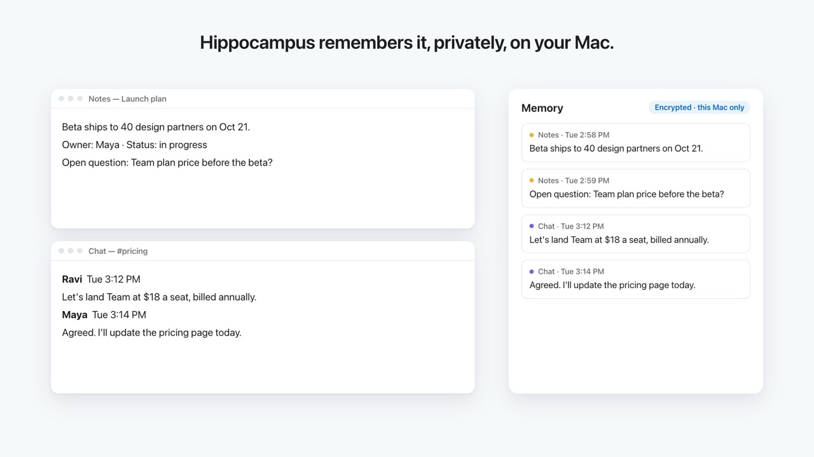
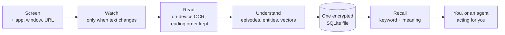

<h1 align="center">Hippocampus</h1>

<p align="center"><strong>Computers should learn from the way you work.<br>First, they have to remember it.</strong></p>

<p align="center">
  <a href="#install">Install</a> ·
  <a href="#the-idea">The idea</a> ·
  <a href="#how-it-works">How it works</a> ·
  <a href="#privacy">Privacy</a> ·
  <a href="#status">Status</a> ·
  <a href="docs/STATUS.md">Release ledger</a>
</p>

---

<p align="center">
  <a href="docs/media/hippocampus-30s.mp4"></a><br>
  <sub><a href="docs/media/hippocampus-30s.mp4">Watch the 30-second clip</a></sub>
</p>

Hippocampus is a private memory for your Mac. It reads what is on your screen as you work (the text, the app, the window, the page, the moment), keeps it in one encrypted file on your machine, and lets you, or an agent working for you, find it again in plain language.

Hippocampus itself has no cloud service. There is no account, no server and no telemetry; the reading, the understanding and the search all happen on your Mac.

## Install

```bash
curl -fsSL https://github.com/amyjainberkeley/hippocampus/releases/latest/download/install.sh | sh
```

or with Homebrew:

```bash
brew install --cask amyjainberkeley/tap/hippocampus
```

Either one installs the notarized app into Applications and opens a short setup that asks which apps it may remember. Nothing is recorded until you turn capture on. It needs macOS 14 or later on Apple silicon. The installer [reads in a minute](scripts/install.sh): it verifies the download's checksum, Apple's notarization and the developer signature, and touches nothing else.

## The idea

**Your computer sees everything you do and remembers none of it.** It saw the paper you skimmed, the number in the dashboard, the error you fixed in March. Then it forgot all of it, so you do the remembering: scrolling history, searching for a word you are not sure you used, re-explaining your project to an assistant that starts from zero every morning.

**How you work is the most valuable record nobody keeps.** Software learns from what we tell it, almost never from what we do: the order we open things, what we skim and abandon, how a real task moves across five apps over a week. Agents now do a growing share of that work, and an agent acting for you is only as good as what it knows about how you work.

Research on [general user models](https://arxiv.org/abs/2505.10831) shows where this goes: a computer that watches how someone works can infer what they are trying to do and what they care about, hold those inferences with confidence, and revise them as evidence arrives. Those systems are only as trustworthy as the evidence beneath them, and today that evidence is usually screenshots on disk sent to a cloud model.

Hippocampus is that evidence layer, built to be trusted. The name is the design. In the brain, the hippocampus records episodes (this happened, here, then) and, over time, hands them to the neocortex, which distills them into lasting knowledge. Hippocampus records the episodes of your work faithfully and privately; the understanding built on top of it cites the moments it came from, and you confirm or correct it.

1. **Remember.** A complete, private, searchable record of what was on your screen. *This release.*
2. **Understand.** Statements about how you work, each linked to the moments that support it, proposed by the system and confirmed or corrected by you.
3. **Act.** Agents that start from your context instead of a blank page.
4. **Share on your terms.** Hand a reviewed slice of your record to a teammate or a study, and nothing more.

## How it works


```mermaid
flowchart LR
    A["Screen<br/>+ app, window, URL"] --> B["Watch<br/>only when text changes"]
    B --> C["Read<br/>on-device OCR,<br/>reading order kept"]
    C --> D["Understand<br/>episodes, entities, vectors"]
    D --> E[("One encrypted<br/>SQLite file")]
    E --> F["Recall<br/>keyword + meaning"]
    F --> G["You, or an agent<br/>acting for you"]
```

1. **Watch.** A Swift helper looks at the screen through ScreenCaptureKit and does work only when something meaningful changed: an idle gate, the system's own change signal, a coarse image hash, and a finer check that notices new words without waking up for a blinking cursor. The window you are working in is read closely; the rest of the screen, including other displays, is read every few seconds when its text changes, and each line is filed under the window it came from.
2. **Read.** Frames are transcribed on the Mac by a bundled PaddleOCR model kept warm between frames, then reassembled the way the screen reads: columns stay columns, tables read row by row, code keeps its indentation. On the [screen benchmark](tools/ocr/screens/) (chat, editor, terminal, mail, tables, small labels), 96.7% of lines come out exactly right with 0.1% character error, in about 1.3 seconds a frame.
3. **Understand.** In idle time, events are grouped into episodes, entities are extracted, and text is embedded by a small on-device model.
4. **Store.** Rows, the full-text index and the vectors all live in one SQLCipher-encrypted file under `~/Library/Application Support/MCI`, with its key in your login Keychain.
5. **Recall.** Search runs keyword and semantic retrieval together, so you can find the exact error code or "that pricing discussion last week."

Agents reach the same memory over MCP (`mci-agent mcp-serve`), with read-only tools for search, recent activity, episodes and a cited context packet. The `mci-agent` command is installed alongside the app.

## Privacy

The promise is that what Hippocampus captures stays on your Mac. These rules enforce it rather than ask you to trust it.

- **Block at the source.** Password managers, Keychain Access, System Settings, major sign-in and banking sites, private browser windows and secure text entry are refused before a frame is read, and you can exclude any app or site. Hippocampus never records its own windows.
- **A second check on text.** Recognized text is scanned for one-time codes, API keys and other secrets before it is stored.
- **One encrypted file.** There is no second store to leak. Deleting a memory removes it with its vectors and links and compacts the file.
- **No keystrokes, no audio.** Only what was visible, and whether you were active.
- **Agents see what they ask for.** When you connect an AI client, a connected AI client sends only the context it requests to its selected provider, under that provider's terms. Nothing else leaves.

[PRIVACY.md](PRIVACY.md) lists every network request the app can make; none carries what you captured. [SECURITY.md](SECURITY.md) says how to report a gap.

## Status

This is a beta. [docs/STATUS.md](docs/STATUS.md) is the ledger of what has been verified and how; this table never claims more than it does.

| Piece | State |
| --- | --- |
| Encrypted store, keyword and semantic search | Works, tested. |
| On-device transcription | Works. Measured on synthetic screens; real-screen accuracy is being measured. |
| Live screen capture | Being qualified on real use. Whole-screen capture is new in 0.2.1. See the ledger. |
| Agent access over MCP | Works. Read-only. |
| Understanding layer (claims you confirm) | Schema built; not yet written by the product. |
| Sync between machines, Windows | Not started. |

## Build from source

You need macOS 14 or later on Apple silicon, Xcode 16 or later and stable Rust.

```bash
git clone https://github.com/amyjainberkeley/hippocampus.git && cd hippocampus
cargo test --workspace
./apps/hippocampus/Resources/build-app.sh
```

[ARCHITECTURE.md](ARCHITECTURE.md) is the system map; [docs/decisions/](docs/decisions/) records why things are the way they are.

## Contributing

The most useful thing right now is telling me where this lost you, or where the app did something other than what it said. Open an issue. If you study how people work on computers, I would like to hear what a private, on-device record of that work would need to be useful to you.

## License

Apache 2.0. See [LICENSE](LICENSE) and [NOTICE](NOTICE).
