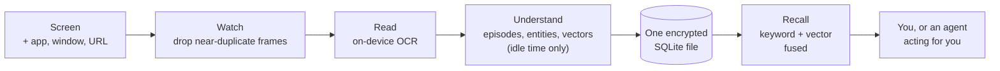

<h1 align="center">Hippocampus</h1>

<p align="center"><strong>Computers should learn from the way people actually work.<br>First, they have to remember it.</strong></p>

<p align="center">
  <a href="#why">Why</a> ·
  <a href="#quickstart">Quickstart</a> ·
  <a href="#how-it-works">How it works</a> ·
  <a href="#stack">Stack</a> ·
  <a href="#status">Status</a> ·
  <a href="docs/GUIDE.md">Guide</a>
</p>

<p align="center">
  <a href="https://github.com/amyjainberkeley/hippocampus/actions/workflows/cargo.yml"></a>
  <a href="https://github.com/amyjainberkeley/hippocampus/actions/workflows/swift.yml"></a>
  <a href="https://github.com/amyjainberkeley/hippocampus/actions/workflows/cargo-audit.yml"></a>
  <a href="LICENSE"></a>
</p>

---

Hippocampus is a memory for your Mac. It keeps a private record of what was on your screen (the text, the app, the window, the URL, the moment) and lets you, or an agent working for you, search it in plain language.

Everything happens on your machine and lands in one encrypted SQLite file. There is no server to trust, because there is no server.

```console
$ mci_recall "finding things by meaning rather than exact wording"

# keyword search only
0 hits

# keyword + semantic
3 hits
  score=0.645  Notion — MCI / Recall UI Spec
  score=0.598  Snowflake Arctic Embed S — Hugging Face
  score=0.594  sqlite-vec — A vector search SQLite extension
```

That is real output from the 20-event demo brain. None of the words in the question appear in the results. You remember what something was about, not what it was called, and search should work the same way.

---

## Why

There are two reasons this should exist. Once you notice them, it is hard to understand why it doesn't already.

### 1. Your computer sees everything you do and remembers none of it

Everyone has a computer, and it is the most context-rich thing they own. It saw the paper you skimmed, the number in the dashboard, the error you fixed in March, the tab you closed by accident. Then it forgot all of it.

So you do the remembering. You scroll through history. You search your files for a word you aren't sure you used. You re-explain your project to an AI assistant every morning, pasting in the same error and the same doc, because it starts from zero every time.

You remember situations: *"that pricing page I looked at last Tuesday, when I was annoyed."* Your computer remembers filenames. The context you need already went across your screen. Nothing kept it.

### 2. How people work is the most valuable record nobody keeps

Software learns from what we tell it: the prompt, the document, the fact we decide to write down. Almost none of it learns from how we actually work, and that is where most of what we know lives. The order we open things in. What we skim and abandon. The tab we keep coming back to. How a real task moves across five apps over a week.

That record mostly doesn't exist. There are plenty of recordings of people doing a task they were handed, in one sitting. There is very little of people doing their own work over weeks, and almost none that stays in the hands of the person it describes.

This gets more important every month, because agents now do a growing share of the work. An agent acting for you is only as good as what it knows about how you work. Today it knows what you typed into its chat box.

### Why now

Both of these have been true for years. Two things changed.

A laptop can now do the whole job itself. Text recognition, embedding models and an encrypted database all run on the machine, so the record never has to leave it. And there is finally something on the other end that can use it: agents that speak MCP (the Model Context Protocol) can query your memory the same way they call any other tool.

Put those together and this stops looking like an idea and starts looking like the next layer of the computer. The hard part was never recording the screen. It is recording it in a way the person can trust, and that is what most of this codebase is about.

---

## Quickstart

Two ways in. Neither needs screen-recording permission.

**See it work in about a minute.** This builds the CLI, makes a throwaway encrypted brain in `./hippocampus-demo/`, fills it with 20 synthetic events, and searches it. Your real data is never touched and nothing goes over the network.

```bash
git clone https://github.com/amyjainberkeley/hippocampus.git
cd hippocampus
./scripts/try-it.sh
rm -rf ./hippocampus-demo     # deletes the data and its only key
```

**Give Claude Code a memory.** `init` makes a key, imports your Claude Code history from `~/.claude/projects`, indexes it, and registers Hippocampus as an MCP server.

```bash
cargo build --release -p mci-agent --bins
./target/release/mci-agent init
./target/release/mci-brain search "some phrase you remember"
```

Then restart Claude Code and ask it what you were working on last week. If anything looks wrong, `mci-agent doctor` says why. `init` keeps the key in `~/Library/Application Support/MCI/dev.key` (mode 0600); lose that file and the brain cannot be opened, which is the point. Without the embedding model, recall is keyword-only and says so at startup. [The guide](docs/GUIDE.md#turning-on-semantic-recall) turns on semantic search in two commands.

### What an agent can ask

| Tool | What it is for |
|---|---|
| `mci_recall` | "That article about Rust I read yesterday." Hybrid search, and the main one. |
| `mci_events_since` | "What happened in the last hour." |
| `mci_episodes` | "What did I work on today," as stretches of focused work. |
| `mci_events_by_app` | "What sites did I visit," scoped to one app. |
| `mci_stats` | Counts and time range. A cheap check that there is anything to search. |

All five are read-only. The server speaks JSON-RPC 2.0 over stdio, so nothing listens on a port.

---

## How it works


```mermaid
flowchart LR
    A["Screen<br/>+ app, window, URL"] --> B["Watch<br/>drop near-duplicate frames"]
    B --> C["Read<br/>on-device OCR"]
    C --> D["Understand<br/>episodes, entities, vectors<br/>(idle time only)"]
    D --> E[("One encrypted<br/>SQLite file")]
    E --> F["Recall<br/>keyword + vector<br/>fused"]
    F --> G["You, or an agent<br/>acting for you"]
```

1. **Watch.** A Swift helper captures the screen only when something meaningful changes, never on a timer. The filters run cheapest first: an idle gate (no input, no capture), the system's own "did anything change" signal, dirty-rect triage, and a 64-bit perceptual hash that drops near-duplicates. This is where most of the engineering lives. An eight-hour day is millions of frames, and the goal is to keep a few thousand moments.
2. **Read.** Surviving frames go through Apple's on-device text recognition, scoped to the regions that changed, and are joined to the app, window title and URL.
3. **Understand.** In idle time, never while you are working, events are grouped into episodes, entities are extracted, and text is embedded by a small on-device model.
4. **Store.** Rows, the full-text index and the vectors all go into one SQLCipher-encrypted SQLite file.
5. **Recall.** A query runs keyword search and vector search together and fuses the results: `0.5 × semantic + 0.3 × keyword + 0.15 × recency + 0.05 × source`, each min-max normalized ([ADR-0010](docs/decisions/0010-event-episode-retrieval-unit-cc-fusion.md)). Keyword search finds the exact error code. Vector search finds "that pricing discussion."

### One seam

Screen capture has to be written once per operating system. Search, ranking and encryption do not. So the system splits along one Rust trait, `CaptureSource`.

```
┌─────────────────────────┐
│  Swift capture helper   │   macOS only. Frames, OCR, window context.
└───────────┬─────────────┘
            │  CaptureSource  ← the only seam
┌───────────▼─────────────┐
│  Rust core + brain      │   Written once. Filter chain, embeddings,
│                         │   encryption, search, ranking.
└─────────────────────────┘
```

Nothing above the seam may contain OS-specific code, so Windows means one new adapter, not a second brain. Pixels never cross the seam as a copy: the adapter lends the core a handle to memory the GPU already owns. Copying every frame is the difference between a program you forget is running and a fan that never stops.

---

## Stack

| Layer | Choice | Why |
|---|---|---|
| Capture | Swift 6 helper on ScreenCaptureKit (macOS 14+) | Event-driven frames, zero-copy `IOSurface` handles |
| Text | Apple Vision OCR, on-device | No network, scoped to changed regions |
| Core | Rust (stable), Tokio | Written once, OS-free above the seam |
| Storage | SQLite + SQLCipher via `rusqlite` (bundled, vendored OpenSSL) | One file, one encryption boundary |
| Keyword search | SQLite FTS5 | Exact tokens: error codes, filenames, names |
| Semantic search | `snowflake-arctic-embed-s` (33M parameters, 384 dimensions) on Core ML. Vectors are rows in the same file, cosine-scanned in Rust | No second store to secure. A full scan is comfortable below about a million events |
| Agent interface | MCP, JSON-RPC 2.0 over stdio | Any MCP client can use it, and there is no open port |
| Understanding | Regex and optional NER entities, episode segmentation, identity linking. Optional Qwen3-1.7B on Core ML for daily briefs | Runs in idle time. Briefs are drafts a human approves |
| Browser context | Chromium MV3 extension + native-messaging host | Clean page text where a browser can provide it |
| App | SwiftUI menu-bar app, Sparkle updates | Native, small, and out of the way |

---

## Principles

These are the rules the code is built around. Breaking any of them breaks the product.

- **Nothing leaves the machine by default.** Capture, OCR, embedding and understanding all run on-device. There is no telemetry.
- **One encrypted file.** No store lives outside the SQLCipher boundary, including the vector index. A second store would be a second boundary, and the weaker one would be the real one.
- **Block at the source, don't scrub afterwards.** Password fields, private browsing, DRM video and denylisted apps are refused before a frame is encoded. Scrubbing later means the data existed.
- **One seam.** Nothing above `CaptureSource` knows which OS it is running on.
- **Fail loudly.** Without the embedding model, recall announces that it is keyword-only. `embed-backfill` refuses to write zero vectors, because a zero vector matches every query equally and would look like a ranking bug instead of a missing model.
- **Write down why.** Every load-bearing decision is a record in [docs/decisions/](docs/decisions/), 37 so far.

---

## Status

Most projects bury this. It belongs near the top, because it decides whether the rest is worth your time.

| Piece | State |
|---|---|
| Encrypted store, keyword search | **Works, tested.** `try-it.sh` runs it end to end. |
| Semantic search and fusion | **Works** once you build the ~66 MB model. Verified on a clean machine: a query sharing no words with the corpus goes from 0 hits to 3 correct ones. |
| MCP server | **Works.** Five read-only tools. |
| Claude Code import (`init`) | **Works.** Message text only; tool calls, tool output, reasoning and images are skipped. |
| Entities, episodes, identity links (`enrich`) | **Works.** Deterministic, no language model. |
| Pulling from other MCP servers (`mcp-sync`) | **Works against a local server.** Loopback addresses only. Untested against third-party servers. |
| Daily brief | **Opt-in.** Needs the Qwen3 model. Every brief is a draft until a human approves it. |
| Mail and Messages | **Read-only.** Nothing is written to the brain until per-source redaction is finished. |
| Live screen capture | **Built, unproven, ships off.** I have not watched it run all day and measured it, so I am not going to tell you it works. |
| Key custody | **Partial.** The CLI keeps the key in a mode-0600 file. Keychain storage is on the v1 branch. Secure Enclave wrapping is designed ([ADR-0008](docs/decisions/0008-encrypted-store-sqlcipher-sqlite-vec-keychain.md)) and not built. |
| Sync between machines | **Skeleton.** The crypto exists. Proof that two devices converge does not. |
| Windows | **Not started.** An empty adapter with the right shape. |

The core has 545 tests (`cargo test -p mci-brain`), and the workspace has 1,581.

If you take one thing from this table: **capture is off by default and unverified.** Everything you can run today is the memory half.

**The full app.** A menu-bar app with live capture, offline OCR and a Today / Search / History window is being built on the [`codex/hippocampus-v1`](https://github.com/amyjainberkeley/hippocampus/tree/codex/hippocampus-v1) branch ([draft PR #25](https://github.com/amyjainberkeley/hippocampus/pull/25)). It runs on my machine, but its CI is not green yet, so it is not on `main` and this README does not claim it.

### Where this is going

Remembering is the first layer. After it, in order:

1. **Prove capture.** A full-day trace of CPU, memory and energy, and OCR accuracy on real screens, before capture is on by default.
2. **Learn from what it remembers.** Statements about how you work, each linked to the moments that support it, proposed by the system and confirmed or corrected by you. Never a conclusion without its evidence.
3. **Share on your terms.** Hand a slice of your record to a teammate or a study, after reviewing exactly what leaves.

---

## Privacy

The promise is that nothing you captured leaves your machine. Here is what enforces it, rather than my word for it.

- **A second layer for text.** Extracted text is checked for one-time codes, bank alerts and API keys, and refused. The check is tested against 133 synthetic message shapes built from public security writeups, NIST guidance and OWASP fixtures, in [core/brain/fixtures/](core/brain/fixtures/). None are real messages.
- **Deleting.** Deleting a memory removes it along with its vectors, entities and links, then rewrites the file (`VACUUM`) so the old pages are gone. Deleting the database and its key makes everything unrecoverable.
- **Network.** The MCP server talks over stdio. `mcp-sync` refuses any address that is not loopback. Crash reports stay off unless you set two environment variables. [PRIVACY.md](PRIVACY.md) lists every network request that exists, and none of them carries memory content.
- **No telemetry.** No analytics, no usage tracking, no crash reporting to me.

Found something wrong? [SECURITY.md](SECURITY.md) says what I most want to hear about and how to report it privately.

---

## Repository layout

| Where | What |
|---|---|
| `core/brain/` | The interesting part. Search, ranking, episodes, embeddings, entity extraction, redaction. |
| `core/` | The portable core: the capture seam, encryption, the SQLite store, IPC. |
| `adapters/macos/` | Swift and macOS-only Rust: screen capture, OCR, Core ML, Mail and Messages readers. |
| `apps/` | The agent CLI and MCP server, the menu-bar app, the recall window, onboarding, the browser bridge. |
| `docs/decisions/` | 37 records of why things are the way they are. |
| `scripts/try-it.sh` | The one-minute demo. |

## Building from source

You need macOS 14 or later on Apple Silicon and stable Rust (1.83 or later). Xcode 15 or later is only needed for the Swift app, not the CLI.

```bash
cargo build --workspace
cargo test -p mci-brain       # the core: 545 tests
cargo test --workspace        # everything: 1,581 tests
```

The build is not yet notarized under my own Apple Developer ID, so an app you build yourself has to be allowed through Gatekeeper by hand.

## Documentation

- [Guide](docs/GUIDE.md): inspecting a brain, turning on semantic recall, connecting other MCP servers, every command, troubleshooting.
- [ARCHITECTURE.md](ARCHITECTURE.md): the system map, written for an engineer reading the code cold.
- [docs/DESIGN.md](docs/DESIGN.md): the full design rationale.
- [docs/decisions/](docs/decisions/): the decision records.
- [PRIVACY.md](PRIVACY.md) and [SECURITY.md](SECURITY.md).

## Contributing

The most useful thing right now is not a pull request. It is telling me where this README lost you, or where a command did something other than what it said. Open an issue.

If you want to write code, `core/brain/` has the most surface area and the best tests to work against. Read [ARCHITECTURE.md](ARCHITECTURE.md) first.

If you study how people work on computers, I would like to hear what a private, on-device record of that work would need to be useful to you.

## License

Apache 2.0. See [LICENSE](LICENSE).
