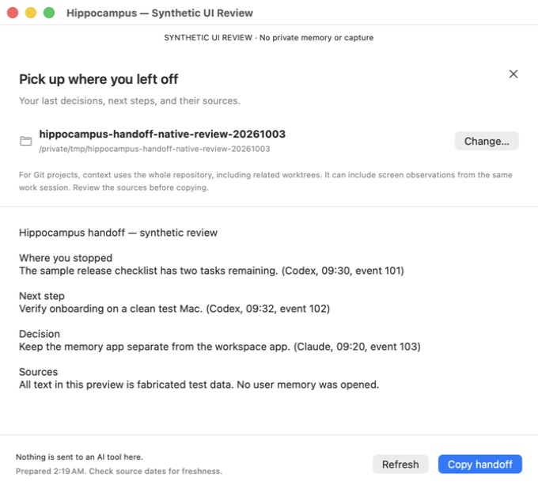

# Hippocampus onboarding and project handoff checkpoint

Date: October 3, 2026. Scope: the standalone Hippocampus memory/recall/MCI
product. Superapp remains an independent app and is unchanged by this patch.

## Changes

### Capture health and recovery

The old permission-log watcher watched the parent directory. Appending an
existing helper log did not generate the directory event it expected. A
temporary-file regression reproduced the lost Screen Recording warning.

The replacement checks file metadata once per second and reads at most
64 KiB per tick. It handles rotation, incomplete lines, and stopped watcher
generations. The parent arms it before starting the helper. Permission events
are delivered in order; only parsed surface enums remain queued while macOS
asks for notification authorization. Cancellation has an observation identity
so an old task cannot clear a restarted watcher's notification. The supervisor
tracks all revoked surfaces; restoring one cannot hide another.

Recall now flags a responsive service with no screen memory saved in the last
five minutes. Explicit pause/suppression reasons still take precedence. A
heartbeat alone is not evidence that capture works.

### Onboarding

Skipping the shortcut exercise is distinct from observing the chord. Skipping
still permits navigation but does not show a success checkmark. Completion
asks the user to verify their first saved source; it does not claim a completed
memory capture or tested global shortcut merely because setup finished.

### Continue a project

Recall's toolbar opens a native handoff sheet with Command–J. The user chooses
a folder, reviews the returned source text, and explicitly copies it. Refresh
clears an older packet before making a new request. Error recovery never leaves
stale context available to copy. Closing/changing the sheet cancels its child
process. Paths are passed as process arguments, not shell commands.

The existing compiler runs with `--no-refresh` and a 600-token target. It may
record a content-free local delivery receipt if it can obtain the writer lease.
A Git folder resolves to the repository root and related worktrees; packets
can include screen observations from the same work session. The sheet explains
this before selection. Folder selection is not a client authorization boundary.
The sheet sends nothing to an AI provider and does not import new sessions.

## Verification

| Check | Result |
| --- | --- |
| Desktop parent Swift suite | 363 tests, zero failures |
| Onboarding Swift suite | 243 tests, zero failures |
| Optimized Recall Swift suite/build | 535 tests, zero failures |
| Existing-file permission append | Failed before repair; passes after repair |
| Cancel/restart while notification authorization waits | Failed before repair; passes after repair |
| Restore one of multiple revoked permissions | Failed before repair; passes after repair |
| Independent source review | No remaining blocking findings in this diff |
| Whitespace/diff validation | Passes |

Builds/tests used explicitly allowlisted environments without provider secrets.
The parent fixture's release-note header now reads the actual bundle version;
the old hardcoded 0.1.0 fixture failed against the existing 0.2.0 manifest.
Test deadlines and production timeouts were not increased to obtain these results.

Native computer use exercised the actual `ProjectHandoffView` in an isolated
review app linked against the built Recall library. Its sibling agent was a
fabricated-output fixture. Verified: empty state, native folder selection,
rendered source text, refresh, failure clearing the prior packet, disabled copy
on failure, and retry recovery. The clipboard button was not used. This proves
those interface states, not the actual compiler or a private-memory handoff.

## Live qualification and remaining work

- The installed owner build is still the previously notarized `f4f7bf1`.
  No new bundle was installed and no private brain migration was performed.
- macOS Screen & System Audio Recording visibly showed Hippocampus off.
  Enabling it reached Touch ID; owner approval is pending. Live capture,
  screenshot persistence, retrieval, and source opening still need a fresh test.
- The new handoff UI needs the matching newer agent; replacing Recall alone
  in the older installed bundle would not qualify it.
- Before upgrading, qualify transcript-import consent. The newer daemon's
  background session import defaults on; this checkpoint does not silently
  install that behavior or treat MCI retrieval consent as universal import consent.
- Resolve the default Command–Shift–Space collision with Superapp Whisper
  without silently overwriting the owner's shortcut preferences.
- Verify full first-run onboarding, controlled upgrade/rollback, notification
  recovery, capture resource limits, and signed distribution on the actual bundle.
- Proactive relevance and predictive handoff quality require measured evidence.
  This checkpoint exposes existing cited context; it adds no claim that the app
  can predict an unstated need or that every integration works.

Website and signup-email work remain deferred. Source publication, local
installation, public downloads, and live end-to-end qualification are separate.
Public production readiness is not established by this checkpoint.

## Publication boundary

Forty older handoff commits had not reached the canonical remote. One
intermediate README revision included actual local-memory output even though
the final README had replaced it with a synthetic fixture. Preserve that
history locally. Publish the final source tree as a new checkpoint on the
existing public `codex/hippocampus-v1` base, without pushing the private
intermediate ancestors. This does not rewrite any published branch. The new
README also removes the unqualified public-install promise and records the
actual development-preview status.

Gitleaks 8.30.1 scanned the complete tracked publication snapshot after its
official macOS archive checksum was verified. It returned 17 alerts. Each
flagged line is byte-identical to a line already on the public base: redaction
test fixtures, fixed test key material, a published archive checksum, or the
Chromium extension's public key. No newly introduced secret match was found.
This is a scoped publication check, not a claim that the app has no security
defects. The unrelated untracked `release-cli/` directory is excluded.

Source checkpoint `75e5e38b17cbd3ca265c684dcdd6c1cc5d124042` was pushed to
`codex/hippocampus-onboarding-handoff-20261003` and its exact remote SHA verified.
[Draft PR #27](https://github.com/amyjainberkeley/hippocampus/pull/27) targets the
existing public development branch. Neither `main` nor any release tag moved.
The final publication keeps that public base's existing hosted-runner Vision
test policy; the older handoff branch had omitted it. Local hardware capture
qualification is still required. This reconciliation changes no production
OCR code or timeout.
