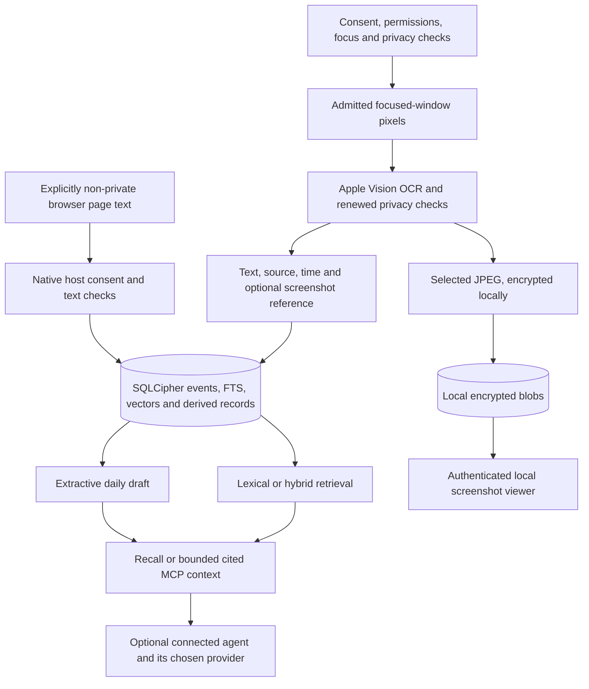

# Architecture

Source audit baseline: [13e7f7a](https://github.com/amyjainberkeley/hippocampus/commit/13e7f7a),
September 7, 2026. This describes inspected implementation; [STATUS](../STATUS.md)
records which source tests and installed checks actually ran.

The native layer owns macOS permissions, focused-window capture, OCR, and display.
Rust owns event storage, indexing, retrieval, evidence relationships, and agent
context. The portable `CaptureSource` contract and local IPC separate these
responsibilities. Windows adapters and server/sync code exist, but their presence
is not evidence of a qualified cross-platform or hosted product.

## Safety Before Persistence

[CaptureConsentAuthority](../../apps/hippocampus/Sources/HippocampusKit/CaptureConsentAuthority.swift)
coordinates capture enablement. The helper binds frames to a focused window and
checks deny rules, secure input, Accessibility classification, protected-surface
signals, and attribution. Unknown classifications can suppress capture. The
[supervisor](../../apps/hippocampus/Sources/HippocampusKit/ProcessSupervisor.swift)
also controls shutdown and bounded recovery; stopping capture must stop ingress.

[SuppressionCascade](../../adapters/macos/MCICaptureHelper/Sources/MCICaptureHelperKit/Suppression/SuppressionCascade.swift)
checks browser-window privacy before admitting excluded browser pixels.
It is not accurate to say all browsers are always captured or always excluded:
pixel admission needs affirmative window-bound proof, and live coverage remains
limited. [Browser extensions](../../extensions/) use a separate structured-text
path requiring an explicitly non-private tab and native-host authorization.

The [post-OCR emitter](../../adapters/macos/MCICaptureHelper/Sources/MCICaptureHelperKit/OCR/OCRPostAllowEmitter.swift)
rechecks privacy and scans completed recognized text before persistence.
The current Vision runner retains the original recognition pass and attempts
bounded supplemental regions inside the admitted area and one-second budget.
Completed pass text remains contiguous for privacy scanning; deduplicating it
too early can hide a secret. OCR is imperfect, and a deadline can withhold a
result. Safety checks do not establish complete recognition or zero leakage.

## Text And Screenshots

[SmartCaptureFilter](../../adapters/macos/MCICaptureHelper/Sources/MCICaptureHelperKit/Capture/SmartCaptureFilter.swift)
filters idle, incomplete, unchanged, and near-duplicate frames. ScreenCaptureKit
has a two-frame-per-second active ceiling. That is a candidate delivery setting,
not the frequency of saved screenshots.

After OCR and privacy approval, [KeyframePolicy](../../adapters/macos/MCICaptureHelper/Sources/MCICaptureHelperKit/Capture/KeyframePolicy.swift)
can retain the first admitted candidate, a changed window, a material visual
change, or a candidate after five minutes without a retained image. Earlier
gates still apply. [KeyframeBlobWriter](../../adapters/macos/MCICaptureHelper/Sources/MCICaptureHelperKit/OCR/KeyframeBlobWriter.swift)
encodes JPEG at a maximum 1280-pixel long edge and quality 0.7. These are
condensed images, not full-resolution video. Production's earlier HEVC stage is
a no-op; retained visual evidence uses the post-OCR JPEG path.

[BrainPump](../../apps/agent/src/brain_ingest.rs) turns admitted messages into
events with source kind and context. Browser page text has distinct provenance.
A text event need not have a screenshot, and a screenshot need not be faithfully
searchable if its small text was not recognized.

## Store And Derived Records

[SQLCipher opening](../../core/src/store/open.rs) enables encryption, WAL, and
foreign keys. [SqlCipherBrainStore](../../core/brain/src/sqlcipher_brain_store.rs)
writes events, source metadata, FTS updates, and any supplied vector in a
transaction. It rejects events marked as suppressed. A process writer lease
prevents concurrent agent writers; read surfaces use separate read-only handles.

Production key custody uses a non-synchronizing macOS file-Keychain item with
trusted-application ACLs. It is not a non-exportable Secure Enclave key.
[The screenshot codec](../../adapters/macos/MCIKeyframeCodec/Sources/MCIKeyframeCodec/KeyframeBlobCodec.swift)
derives per-blob keys with HKDF and random salt, uses AES-GCM, and names each
blob by the SHA-256 of its encrypted bytes. The database holds references;
encrypted images live beside it in `blobs/`. Local deletion does not erase
external copies, exports, backups, or all forensic traces.

Embedding backfill fills missing event vectors. Episode segmentation groups
events by temporal/app context; entity extraction and alias resolution supply
links. The [consolidator](../../core/brain/src/consolidator.rs) reconciles
shared-identity edges between episodes. It does not replace old events with a
summary or compact screenshots. [Retention](cost-and-storage.md#retention-and-budgets)
is a separate deletion mechanism.

## Retrieval And Agent Context

**Lexical search** uses FTS5/BM25 over stored text, summary, title, and URL.
It is useful for distinctive words and identifiers, but is tokenized search,
not byte-for-byte string equality. The sanitizer treats pasted `AND`, `OR`,
and `NOT` as literal words; internally generated alternatives use a separate
bounded API.

**Semantic search** embeds the query locally with Arctic Embed S and compares it
against stored 384-dimensional vectors. Current similarity search scans vectors
in Rust, with app/time filtering available; the sqlite-vec index is deferred.
The hybrid retriever combines rank-based lexical/semantic signals with recency,
source, and entity signals. Similarity is not a truth score.

Without a separately qualified evidence verifier, related candidates remain
degraded context. Missing, contradictory, or insufficient evidence can cause
abstention. The governed claim ledger preserves source citations and explicit
status changes; it does not automatically turn screenshots into verified facts.

[MCP context](../../apps/agent/src/context_packet.rs) packages bounded excerpts,
citations, source priority, and retrieval outcomes. Request budgets use token
estimates plus byte/evidence limits, not the external model's exact tokenizer.
Packet deduplication does not delete source rows. Local `mci-agent context`
uses the same compiler. Registration and an optional session hook make context
available to clients; provider access and billing remain with the chosen client.

Current scheduled/Today briefs use [ExtractiveBriefAuthor](../../core/brief/src/extractive_author.rs).
It selects at most nine cited bullets within a bounded body, using lexical rules
and source-context deduplication. Daily input is sampled when it exceeds the
worker's bound. Qwen authoring code remains optional; it is not the default
daily path. Neither briefs nor episode durations establish measured activity,
task completion, or reliable commitment tracking.

## Code Map

| Responsibility | Entry point |
| --- | --- |
| Capture lifecycle and IPC | [Helper main](../../adapters/macos/MCICaptureHelper/Sources/MCICaptureHelper/main.swift), [core IPC](../../core/src/ipc/) |
| Key custody | [macOS Keychain adapter](../../adapters/macos/mci-keychain/src/lib.rs), [agent key resolver](../../apps/agent/src/key_resolver.rs) |
| Schema and retrieval | [brain migrations](../../core/brain/migrations/), [hybrid retriever](../../core/brain/src/hybrid_retriever.rs) |
| Durable claims and corrections | [memory delta](../../core/brain/src/memory_delta.rs), [projector](../../core/brain/src/memory_projector.rs) |
| Background work | [agent entry point](../../apps/agent/src/bin/mci_agent.rs), [brief worker](../../apps/agent/src/brief_worker.rs) |
| Native memory workspace | [Recall](../../apps/recall-ui/), [Rust FFI](../../adapters/macos/mci-brain-ffi/) |
| Agent integration | [MCP](../../apps/agent/src/mcp/), [client registry](../../apps/agent/src/client_registry.rs) |
| Product website | [website/](../../website/), separately deployed from desktop builds |

The older [ARCHITECTURE.md](../../ARCHITECTURE.md) and ADRs include planned
behavior. Use code, scoped evidence, and current STATUS to resolve differences.
