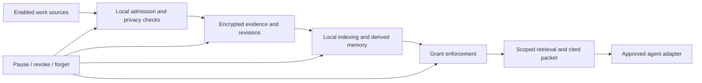

# Hippocampus: work memory for your agents

**Decision proposal and PRD — September 25, 2026, America/Los_Angeles.** Research accessed September 26 UTC. Prepared against source `09950fa`; this is a proposed product direction, not an implementation or launch announcement. [STATUS](../STATUS.md) remains the authority on what works today. This refreshes the [September 8 proposal](2026-09-08-local-memory-product-plan.md).

## 1. The decision

Build **Hippocampus as a private, local work-memory service that helps existing agents continue your work**. Keep a small native interface for finding sources, correcting memory, controlling capture, and seeing what was shared. Integrate with OneKit later as another approved client.

The promise: **“Your agents can pick up where you left off, without making you explain everything again.”**

The core job remains useful even when models have larger context windows or native memory: information from the user's other applications still needs to be acquired with permission, attributed, kept current, selected for the task, and delivered. That is a product hypothesis to test, not proof of market demand or a permanent moat.

| Direction | What it gives us | Main cost | Decision |
| --- | --- | --- | --- |
| Local work memory with agent adapters | Directly addresses repeated explanation; builds on existing code | Capture, access control and continuity must be reliable | **Build first** |
| OneKit-style suite: mail, calendar, chat, agents, browser/computer | Owns a large part of the workflow | Competes on many mature surfaces; increases integrations and security exposure | Integrate with it; do not rebuild the suite now |
| Company Brain first | A shared Slack/workspace assistant with clear team workflows | Requires identity, source permissions, administration, revocation and cloud operations | Separate later product surface |

“MCI” in this repository means **Memory Context Interface**, not MCP. MCP is an integration protocol, not automatic memory delivery. The exact Meta initiative the owner means remains unconfirmed. Historical ADR-0027 describes an internal Meta pattern without a verifiable primary specification; that narrative is not a basis for this PRD. The personal product should help its owner, with no manager access to personal screen history by default.

## 2. What changed in the market

These are primary-source observations, not hands-on competitor benchmarks. Search snippets can be stale; live documentation controls the comparison. No claim of market leadership, retention, or willingness to pay is established by these sources.

| Product or technology | What the current evidence says | Our decision |
| --- | --- | --- |
| Supermemory Company Brain | The company discontinued the hosted product in September, then published the Company Brain repository on September 25. The Apache-2.0 app runs around Slack and Cloudflare; its documented setup requires Supermemory and model-provider API keys. “Local development” is not offline inference/storage. | Learn from its permission and collaboration patterns for a later team edition. It does not replace a local Mac recorder. [Repository](https://github.com/supermemoryai/company-brain), [discontinuation](https://supermemory.ai/blog/an-update-to-supermemory/) |
| Supermemory memory engine | Current documentation advertises a local/self-hosted option. The public wrapper, binary distribution and underlying engine source/license boundaries need component-level verification before redistribution. | Run a bounded comparison if useful; do not rewrite the working Rust store around an unqualified dependency. [Repository](https://github.com/supermemoryai/supermemory), [self-hosting](https://supermemory.ai/docs/self-hosting/overview) |
| Jev | TypeSafe's September 15 launch describes a model for typed probabilistic decisions. Current docs expose a hosted text API; no official local weights were found. Its own limitations include adversarial inputs and errors in temporal reasoning. | Optional experiment for selecting relevant candidates. It is not OCR, a memory database, a permission system, or a correctness guarantee. [Launch](https://typesafe.ai/blog/introducing-system-one-models-and-jev), [models](https://docs.typesafe.ai/models), [limitations](https://docs.typesafe.ai/model-jaggedness/jev-1.13) |
| Jev memory projects | `jev-memory` separates write/retrieve/evict selection; Jev-Mem explores source-preserving memory and graph retrieval. Their evaluation conditions are not a noisy desktop-work benchmark. | Borrow the separation of selection from generation, and test it locally before adopting a provider. [jev-memory](https://github.com/NicolasMontone/jev-memory), [Jev-Mem](https://github.com/libingzheren/Jev-Mem) |
| OneKit | The live site positions a broad business assistant; developer docs expose integration surfaces. Its current privacy page distinguishes local OCR from backend model processing. | A possible distribution/interface partner. Respect its data-access boundaries; integration must not circumvent restricted sources. [Product](https://onekit.co/), [developer docs](https://onekit.co/docs), [privacy](https://onekit.co/privacy) |
| Microsoft Recall | Microsoft documents opt-in local snapshots, filtering, deletion and storage allocation. A sanctioned snapshot export exists for specified EEA devices. | Local screenshots alone are insufficient differentiation. Prove cross-application, cross-agent continuation. [Privacy](https://support.microsoft.com/en-us/windows/privacy/privacy-and-control-over-your-recall-experience), [management](https://learn.microsoft.com/en-us/windows/client-management/manage-recall), [export](https://support.microsoft.com/en-us/windows/ai/ai-features/export-recall-snapshots) |
| Native agent memory | Claude Code documents repository memory and lifecycle hooks. Anthropic recommends bounded context, structured notes and progressive retrieval. | Complement native memory with permitted evidence from other work. Demonstrate benefit over native memory alone. [Memory](https://code.claude.com/docs/en/memory), [hooks](https://code.claude.com/docs/en/hooks), [context engineering](https://www.anthropic.com/engineering/effective-context-engineering-for-ai-agents) |
| Screenpipe | A direct capture-for-agents alternative. Its current commercial license requires paid licensing for commercial use and embedding; historical MIT releases are a separate case. | Benchmark its experience where permitted; current source is not a permissive component for this product. [Current license](https://github.com/screenpipe/screenpipe/blob/main/LICENSE.md) |
| Mem0/OpenMemory | Memory infrastructure is reusable, but the old OpenMemory application was removed from the active Mem0 tree in July 2026. | Evaluate the maintained library/server, not an obsolete setup guide. [Mem0](https://github.com/mem0ai/mem0), [removal PR](https://github.com/mem0ai/mem0/pull/6530) |
| Rewind/Limitless | The official notice describes Meta's acquisition and the shutdown of Rewind screen/audio capture in December 2025. | Treat it as a historical precedent; user export and continuity must survive a product shutdown. [Notice](https://www.limitless.ai/) |

OneKit's privacy page is dated September 26 while the owner's local date is September 25; the research access time is already September 26 UTC. Record this as a live observation, not evidence of when that policy first took effect. Jev's schema guarantees do not mean its decisions are always correct. No-training policies, zero retention, and on-device processing are different properties.

Source pins for reproducibility: Company Brain `0071d6164991ce5dccddbd645bcac631ee477572`; Supermemory inspected main `cfa6c7cb17476d19ea896867406c80e8186a72ec`; Mem0 removal `ea2ee0758635a9230bd60855c3fe339170f6cd18`; Screenpipe license revision `dec77eb6ec69959c78fa27722ace989892bba86a`. Supermemory's [0.0.7 binary release](https://github.com/supermemoryai/supermemory/releases/tag/server-v0.0.7) states a 10,000-document cap; its applicability to the current binary remains unresolved. Do not treat a root MIT license as a complete binary redistribution audit.

## 3. Customer, jobs and scope

**Initial customer:** one person on an Apple Silicon Mac who works across documents, browser applications and coding/AI tools. Start with founders, builders, researchers and consultants already suffering from repeated context setup. Company-wide administration is not required for the first useful experience.

**Owner requirements:** automatic permitted capture; local/private memory; minimal disk and Activity Monitor footprint; no routine drag-and-drop; context that follows work between approved agents; a clean product with a path toward useful actions and team use.

**Working assumptions:** macOS first, existing agents remain the place people do tasks, English work-text is the first qualified language, and a useful personal beta precedes team deployment. These assumptions can change during review.

Three launch journeys:

1. **Continue yesterday's project.** Open a supported agent in an approved project. It receives the current task, grounded decisions, unresolved questions and relevant source links. It asks only for genuinely missing information.
2. **Find the thing I saw.** Search a phrase or describe the work. Open the original permitted source or retained image, with timestamp and an honest indication when a source has expired or was not captured.
3. **Correct or forget.** Mark a claim wrong, exclude an application, revoke an agent, or forget a time range. Future retrieval, derived memory and caches respect that change.

Not in the first release: a replacement email/calendar client, a cloud computer, covert or universal recording, audio capture, keystroke logging, employee rankings, model training on captured work, cross-device synchronization, or unattended form submission. These are deliberate scope choices. “Hands-free” means useful automatic operation within permissions, not recording every pixel or bypassing another application's privacy controls.

## 4. Experience and functional requirements

| ID | Requirement | Acceptance condition |
| --- | --- | --- |
| CAP-1 | Capture only enabled applications/sources and admitted foreground content. Prefer structured text where allowed; use OCR for image-only evidence. | A defined exclusion corpus produces no persisted content from forbidden sources; permission loss stops capture and is visible. |
| CAP-2 | Preserve readable text before storage compression. Track dropped/failed capture as health information. | OCR is evaluated by source type, font size and language; capture gaps are reported rather than represented as complete history. |
| MEM-1 | Preserve canonical evidence, timestamps, source identity, scope and revision. Keep observations distinct from claims. | A displayed decision either has supporting evidence and a status or is explicitly uncertain. Screenshots are never treated as instructions. |
| MEM-2 | Track superseded and conflicting information. User-confirmed facts outrank inferred observations without erasing the record of change. | Contradiction and stale-decision test cases do not silently resurrect an obsolete answer. |
| CTX-1 | Automatically provide a bounded handoff in explicitly supported client lifecycles. | A fresh real agent session can continue a captured task without file upload or copy/paste; test start, resume and compaction independently. |
| CTX-2 | Enforce client and project grants before ranking or rendering anything. | Project B evidence is inaccessible to a Project A grant through search, context, event enumeration, source expansion and image access. Empty retrieval never broadens access. |
| CTX-3 | Show delivery health and provenance. | The UI distinguishes connected, requested, supplied, stale and unavailable. A successful tool response is not claimed to prove the model used it. |
| TRUST-1 | Pause, exclusions, correction, deletion, export and agent revocation are ordinary controls. | Pause/revoke acknowledges only after the barrier is effective; already-running work cannot publish excluded content afterward. |
| STORE-1 | Enforce a whole managed-memory budget, including temporary growth. | Bounded writes and maintenance cannot grow the managed store beyond its reservation limit; protected data causes a pause instead of silent deletion. |
| UX-1 | Reach a first verified result through progressive onboarding. | Install → choose sources/privacy → capture/refind sample → connect one agent. Advanced connectors/models stay optional. |

The native interface has **Continue**, **Search** and **Settings**. Continue shows recent project state with sources, never fabricated completion or productivity scores. A compact status item makes recording, paused, blocked and catching-up states visible. Settings contains source rules, connected-agent grants, storage usage, expiration rules and a recent sharing receipt. The user should not need to keep a dashboard open.

## 5. Architecture and automatic context

Reuse the existing Swift capture/UI, Rust store/agent, SQLCipher, source IDs, encrypted image blobs and MCP integration. Do not introduce a second authoritative memory database.

**Evidence record:** source ID, capture time, stable project/scope ID, source revision, admitted text/image references, extraction quality and retention state. **Derived claim:** exact supporting event IDs, observed/inferred/confirmed/disputed/superseded status, validity interval and derivation version. **Grant:** client capability, allowed scopes and source types, delivery mode, expiry/revocation version. **Packet:** task focus, source revisions, scoped claim/evidence IDs, freshness, budget and abstention reason. Grants are issued by the trusted local control plane; prompt text cannot grant access.

Project assignment affects confidentiality. A folder basename or semantic classifier is not sufficient authority. Use explicitly approved project roots, URLs and artifacts; keep ambiguously assigned material personal/unshared. A search focus only narrows the already-authorized set. Citation expansion and caches use the same checks. Cache keys include grant revision and deletion epoch; revoked grants fail even if a packet is cached.

The existing direct CLI/FFI readers must not become an alternate unrestricted path around a scoped MCP grant. Move machine-client access behind the broker's key authority and enforce grants across context, recall, events, episodes, statistics, export and image expansion. Owner-wide maintenance/export requires a distinct locally authorized route. Audit legacy direct-Keychain readers before advertising isolation. An agent independently given unrestricted shell, file or key access has a broader OS authority than its Hippocampus grant; the UI must disclose that boundary and must not label such a configuration isolated merely because its MCP requests are filtered.

**Retrieval:** deterministic access/validity filtering → lexical and local-vector shortlist → source/time/diversity scoring → deduplication → budgeted packet. Preserve exact identifiers, quotations, dates, constraints and disagreements. Start with extractive packets; add generated synthesis only after evidence-support evaluation. Do not infer success from reading a screen or seeing an attempted action.

**Delivery contract:** aim for 600–1,200 total serialized tokens initially, up to eight sources; expand on demand. Count metadata and source labels, not only prose. Enforce an independent byte ceiling. Refresh on a supported session/task transition, new relevant evidence, correction or revocation; do not reread the entire archive every turn. Revalidate grants on every request. If task identity is absent, return an unavailable/project-selection response instead of recent global activity.

| Client surface | Initial plan | Boundary |
| --- | --- | --- |
| Claude Code | Qualify and tighten the existing opt-in session hook; test startup/resume/clear/compact. Add task-focused refresh only through documented supported hooks. | Never assume hook registration proves delivery or model use. |
| Codex | Evaluate current native hook support alongside existing MCP/project instructions; qualify actual start/resume behavior on each supported CLI/app version. The [Supermemory Codex plugin](https://github.com/supermemoryai/codex-supermemory) is a concrete integration reference. | Do not assume a plugin's CLI lifecycle works identically in every desktop/cloud client. |
| OneKit | Later SDK/MCP adapter for the same granted packet API. | Its permitted integration surface controls what can be exchanged. |
| Other MCP clients | Callable retrieval first; label automatic delivery separately. | MCP availability alone does not make a client request context. |

Use thin client adapters over a single memory service so new agent sessions do not each load their own model or duplicate the whole index. Clients cannot edit capture policy or authorize actions by returning generated text. MCP security boundaries and credential handling should follow the protocol's [security guidance](https://modelcontextprotocol.io/docs/draft/tutorials/security/security_best_practices).

## 6. Compression, RAM and storage

Four separate budgets are required: **disk history**, **resident working memory**, **context tokens**, and **installed app/models**. A shorter summary does not necessarily reclaim database pages or release an OCR process's RAM.

Proposed defaults below are **targets to measure and qualify**, not current performance claims. Apply new retention choices only after informed setup/review; do not retroactively delete existing owner history. Age limits are maximum retention, not guaranteed minimum history: the cap may evict unkept evidence earlier, and onboarding must say so. Show the actual oldest available evidence and a before/after preview when changing policy.

If an existing store exceeds the proposed cap, keep it readable, pause new ingestion and ask the owner to review a cleanup preview or choose a larger cap. Do not treat installation, a default change or disk pressure as consent to truncate that history.

| Resource | Proposed beta target | Enforcement/measurement |
| --- | --- | --- |
| Managed memory on disk | 5 GiB default cap; adjustable. Includes DB, WAL/SHM, blobs, indexes, caches and maintenance scratch. | At 90%, reclaim eligible data toward 80%. Reserve worst-case transaction/scratch space before admission. Stop new retention if it cannot fit. |
| Images | Optional encrypted source images, seven-day default lifetime within the shared cap. | Deduplicate before encryption, bound per-image encoded size, and evict eligible old images before text. No video stream archive. |
| Observed text and derived notes | 30-day default; explicitly kept items stay within the cap. | New policy requires review. References expose source expiration; unsupported derivatives are invalidated. |
| Durable user-kept knowledge | Retained until corrected/deleted or the user changes policy. | Keep its required supporting text/revision too, or store the user's explicit confirmation as new evidence. Never automatically destroy kept items to satisfy an importance score. If they fill the cap, pause and show choices. |
| Resident memory | Whole Hippocampus service/UI/client-adapter tree: idle p95 ≤200 MiB; active p95 ≤600 MiB; OCR burst target <1 GiB. | Measure physical footprint consistently over an eight-hour trace on a 16GB Apple Silicon Mac; distinguish shared pages and peak from sustained usage. |
| Background CPU | Idle p95 ≤1% of one core; mixed-work recorder average ≤5% of one core over the trace. | Track CPU seconds/wall time, energy and temperature; throttle capture/index work before making resource claims. Record capture loss at every setting. |
| Latency | Warm packet p95 <500 ms; cold request returns useful context or explicit unavailability within 2 s. New evidence searchable p95 <15 s in the qualified workload. | Context reads never start expensive cold OCR synchronously. Report misses and timeouts, not only completed successes. |
| Installation | App and required models target ≤600 MiB; optional models opt-in and accounted separately. | One copy of each model per installation. Exports and user recovery backups have separate visible accounting and are not silently purged. |

**How to get there:** capture changes instead of repeated frames; preserve source text when available; use high-resolution pixels ephemerally for OCR; retain only selected bounded images; coalesce repeated observations without discarding change history; compact cold text losslessly where compatible with indexing; evict/rebuild derived indexes; unload idle models. Benchmark a short-lived warm OCR worker against one-shot startup. Keep at most one active inference and one replaceable pending frame when feasible, rather than accumulating large pixel buffers. Any worker reuse must preserve cancellation, source admission and post-inference privacy checks.

Lossy semantic summarization is separate from lossless compression. Summaries may omit details; they must not replace the only surviving evidence silently. Drop content from a packet freely when irrelevant; deleting durable evidence requires the configured retention policy or the user's request. Embeddings and indexes also need storage accounting and deletion.

The cap includes a maintenance reserve; ordinary admission stops below that reserve. Prefer bounded checkpoint/incremental reclamation over a full VACUUM requiring another database-sized temporary copy. Account for allocated disk bytes and WAL growth, keep free-space headroom, and refuse an operation whose peak cannot fit. Explicit user backups are separately owned and must never be the quota worker's deletion target.

Measure balanced quality/resource presets before offering them. If the default cannot meet its budgets, reduce capture rate or optional enrichment, or keep the build in beta; do not hide the result by renaming a metric. A small process screenshot or a thirty-minute helper-only sample does not establish a full-day product budget.

## 7. Privacy, security and company use

Default to on-device capture, OCR, indexing and retrieval. Offer two clearly described connection modes: **Local only**, and **Approved agent sharing**. The second can automatically supply permitted packets under a standing grant after setup. If the chosen agent uses a cloud model, that packet can leave the Mac; local storage does not make that inference local. Do not promise control over a third-party agent's downstream handling.

Exclude sensitive sources before persistence, and recheck privacy after extraction. Password/secret detection is defense in depth, not a guarantee of catching every secret. No hidden collection, private-mode circumvention, blanket browser extraction, content analytics or default training upload. Captured documents, pages and images are untrusted data even when they contain instructions.

Keep keys out of ordinary config and logs; retain the existing OS-protected key handling and authenticated image encryption. Test permissions, crash recovery, migration, signature/model verification and key continuity. Protect the store from ordinary unauthorized access; do not claim it withstands a compromised OS or an administrator controlling the running session. “Fully secure” is not an evidence-backed launch claim.

Forget must immediately prevent retrieval, then remove dependent claims, vectors, cached packets and unreferenced blobs. Backups and already-exported agent copies need separate disclosure; deletion cannot recall bytes an external recipient already received. Never automatically restore deleted material from a recovery snapshot. Storage reclamation, logical deletion and guaranteed forensic erasure are distinct.

**Company phase:** personal raw history remains owner-controlled. Share selected project artifacts or approved packets into a separate workspace ledger with membership and document access rules, revocation, audit and deletion propagation. Do not infer organization-wide visibility from employment or device enrollment. No manager timeline, employee ranking, or raw-screen aggregation in this proposed scope. Independent security review and deployment-specific compliance assessment precede enterprise claims.

## 8. Jev and build-versus-reuse decisions

Keep Jev out of the default local processing path. First ship deterministic scope/validity checks and local retrieval. In an optional experiment, compare: baseline local ranking; a local reranker; and hosted Jev scoring on the same already-authorized candidate shortlist. Use synthetic or explicitly approved evaluation data. No captured work is uploaded as part of this PRD.

Score relevance, stale/conflicting evidence, answer support, latency and total resource cost. Pin model/question versions; measure probability calibration on our data. A classifier may recommend selection or a tentative interpretation. It cannot grant permission, override exclusion, mark a claim true by itself, or delete user-kept evidence. TypeSafe's [published limitations](https://docs.typesafe.ai/model-jaggedness/jev-1.13) support treating its output as fallible.

Reuse the existing Hippocampus store and capture controls. Reuse a maintained library only when its license, offline dependencies, migration cost and measured advantage are clear. Supermemory Company Brain is a later collaboration reference, not a reason to add Slack, Cloudflare and hosted memory to the personal edition. Open-source application code does not imply open model weights or private/local inference.

## 9. What exists, and what blocks release

| Existing foundation | Unfinished requirement |
| --- | --- |
| Encrypted evidence, lexical/vector retrieval, images, deletion machinery | Total byte budget, bounded maintenance and qualified compression cascade |
| MCP context and Claude session hook | Explicit scope grants, stable project identity, real client lifecycle qualification |
| Native search/history/Today and privacy UI | Short onboarding, reliable health state and proven continuity journey |
| Signed/notarized PaddleOCR candidate; synthetic improvement | Installed version still `fe90a3d` on September 25 inspection; live capture and new OCR resource qualification remain open |
| Local test coverage and release checks | Existing hosted real-Vision failures, actual fresh-screen proof, restart/readback and second-Mac upgrade/key continuity remain unresolved |
| Release/model verification code | The public model manifest remains `UNPROVISIONED`; immutable required-model distribution and clean updater reconstruction are still release work |

Grounding: [STATUS](../STATUS.md), [storage audit](../guide/cost-and-storage.md), [OCR audit](../audits/2026-09-11-ocr-quality.md), [observable gates](../audits/2026-09-07-observable-gates.md). Code entry points: `SessionContextHook.swift`, `apps/agent/src/mcp/server.rs`, `apps/agent/src/context_packet.rs`, `core/brain/src/retention_purger.rs`, and `apps/agent/src/retention_worker.rs`.

The current hook derives focus from a directory name; context focus is retrieval relevance, not authorization. The old onboarding resource claims are not established for the new PaddleOCR process tree. These are concrete reasons to finish and qualify the existing system before widening the product.

## 10. Execution order and definition of done

This is the product roadmap for review; implementation estimates require the selected slice's technical plan. Parallel work is useful after shared schemas and acceptance tests are agreed. Never edit the live database or perform an old-build downgrade to speed up a deadline.

| Order | Workstream | Deliverable and exit condition |
| --- | --- | --- |
| 0 | Reliable owner install/capture | Identify current/candidate builds, complete a safe update with quiescent encrypted backup, and prove fresh screen → stored evidence/image → restart → retrieval. Resolve capture failures; preserve consent and keys. |
| 1A | Resource limits | Implement whole-store accounting, reservations, retention priority and memory-pressure behavior; measure quality/resource tradeoffs. |
| 1B | Scope and context delivery | Implement grants/stable scope identity, enforce all read/expansion paths, qualify one real automatic client before a second. |
| 1C | UX and evidence fixtures | Simplify setup and health screens; build synthetic/adversarial continuation cases and truthful sharing receipts. Can proceed alongside 1A/1B against agreed contracts. |
| 2 | Owner beta | One complete continuation workflow with no upload/copy-paste, immediate pause/revoke/forget, bounded storage and an actual resource report. |
| 3 | Invite beta | Five to ten opted-in testers, second-Mac install/update, sleep/wake and eight-hour resource tests; diagnose dropped capture and failed continuations. |
| 4 | Public Mac release | All P0 gates pass on a declared supported matrix; no unresolved critical/high security findings; immutable model archives and verified manifests replace `UNPROVISIONED`; clean updater reconstruction, signed artifacts, model rights, recovery/export, support and truthful public claims pass. |
| Later | Autofill and teams | Add one reversible action workflow, then explicitly shared workspace memory. Neither is needed to validate the core promise. |

**First implementation slice:** an owner can capture a new source, restart, and receive a correct cited handoff in one approved agent. Fix the installation/capture gate before spending another day on dashboards or model experiments. Scope/retention work follows or runs in parallel only where it cannot destabilize that proof.

The requested “done today” should not be converted into an unsupported public-release claim. September 25's concrete deliverable is this current research and executable product decision; the next build milestone is a verified owner beta. An eight-hour soak, multi-user trial and second-machine qualification take actual elapsed time. Public availability follows their results, not a date declaration.

### Release scorecard

Proposed thresholds, to be frozen before evaluation; they are not measured results:

Freeze the task corpus, success rubric, model/client versions, tools and permission sets before running. Compare native memory alone, Hippocampus context and manually curated context with identical task information and resource limits. Reset session/cache state between trials, prevent future evidence from entering earlier tasks, and split held-out projects/users from tuning data. Run at least three paired trials per task and report task-level confidence intervals, failure categories and the complete results, including timeouts. Human rubric-based review is primary; model grading is supplementary. Real-user trials require opt-in and keep private evidence out of published fixtures.

- **Continuity:** at least 90% success across 40 held-out, source-grounded continuation tasks; report native-agent-only baseline and a manually curated context upper bound. Record corrections, wrong assumptions and seconds to resume.
- **Benefit:** at least 50% less user-supplied setup text than the native-memory baseline without lowering task success. Recruit ten target users; proceed beyond invite beta only if at least six use it on three separate days and report a concrete useful continuation. This is a decision rule, not a demand forecast.
- **Evidence:** all factual packet claims have resolvable authorized sources or explicit uncertainty; include conflicting dates, superseded decisions, ambiguous people, damaged OCR and expired sources.
- **Isolation:** zero unauthorized reads in the fixed cross-project/client adversarial suite, including citations, images, logs and caches. A pass does not prove absence of all vulnerabilities.
- **Deletion/revocation:** concurrent tests prove no post-acknowledgment publication or retrieval; crash/restart does not restore removed information.
- **Delivery:** fresh-session and resume tests pass in each advertised client/version; unsupported combinations are labeled. Missing memory degrades honestly and never blocks work indefinitely.
- **Resources:** whole-product trace meets the selected disk/RAM/CPU/latency budgets; report OCR quality and lost capture alongside savings.
- **Distribution:** clean install/update/uninstall, key continuity, sleep/wake, permission changes, export and recovery pass on the supported matrix. Existing OCR/CI failures are resolved or removed from advertised support through an explicit qualified product change, not ignored.

## 11. Later actions and commercial test

The first action feature should fill a **draft** project update or common user-confirmed profile fields from cited facts. Show the destination and proposed values; keep final submission separate. Do not start with payments, passwords, unrestricted computer control or automatic sending. An actions layer must not turn untrusted screen instructions into authority.

Business model hypothesis: a paid personal product that works locally without metered cloud inference, with clearly separate optional provider costs. Test willingness to pay after repeated continuity wins; do not add billing or invent a price before that evidence. Team pricing comes with a distinct shared-memory service and verified administration/security, not access to individual screens.

Open questions for review: confirm the intended Meta MCI reference; confirm the first customer is an individual Mac user; choose the first agent for the owner beta. Until corrected, the recommendation is **personal Mac memory first, Claude Code lifecycle qualification first, Codex next, OneKit integration later**. The proposed product remains interoperable rather than requiring a new agent harness.
